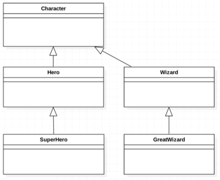

## 1. 상속
- 상속은 이미 만들어진 클래스를 그대로 물려받아 새 클래스를 만들고, 필요한 부분만 하위 클래스가 물려받거나 재정의(override)하는 것
- 완전히 새로 만드는 것보다 빠르고 편하고, 공통된 코드를 여러 클래스에서 공유할 수 있어서 유지보수도 쉬워짐
- 상속의 목적은
  - 코드 재사용
  - 기능 확장
- override: 부모 클래스에 있는 메소드를 자식 클래스에서 재작성할 경우
- extends 키워드로 상속

## 2. is-a 규칙에 따른 상속
- 이 클래스가 저 클래스의 일종인가? ex) car is a vehicle
- Potion is a Weapon
  - 포션은 무기가 아니라서 이 경우는 상속을 하면 안 되지만,
  - 포션을 던져서 데미지를 입힐 수 있는 게임이 있다면, is-a 관계가 성립됨

## 3. 구체화와 일반화

- 부모일 수록 추상적이고
- 자식일 수록 구체화가 됨

## 4. 상속의 사용
- 자바에선 다이아몬드 문제 때문에 다중 상속을 지원하지 않으나
- 인터페이스는 가능하다

### 부모 메서드의 생성자 호출
- super 키워드 사용
- 만약 super가 없을 시 암묵적인 super가 됨
<pre>
<code>
public GreateWizard(String name, Wand wand, int hp, int mp) {
        super(name, wand, hp, mp);
}
</code>
</pre>

### override를 할 시, annotation 사용
- @override로 명시
- annotation을 작성하지 않는다고 해서 문제는 없으나, 규칙이기에 쓰도록 하자