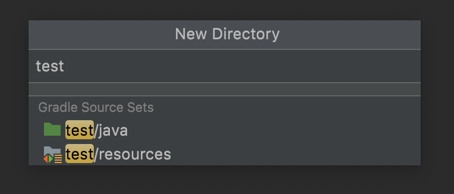
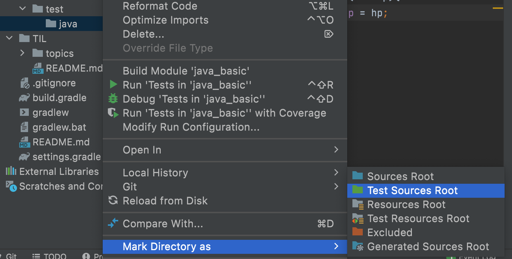
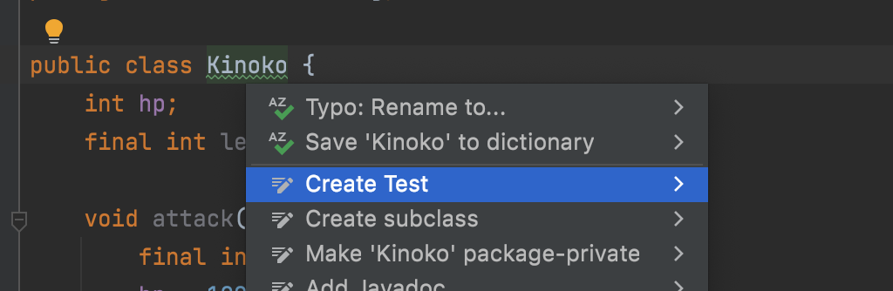
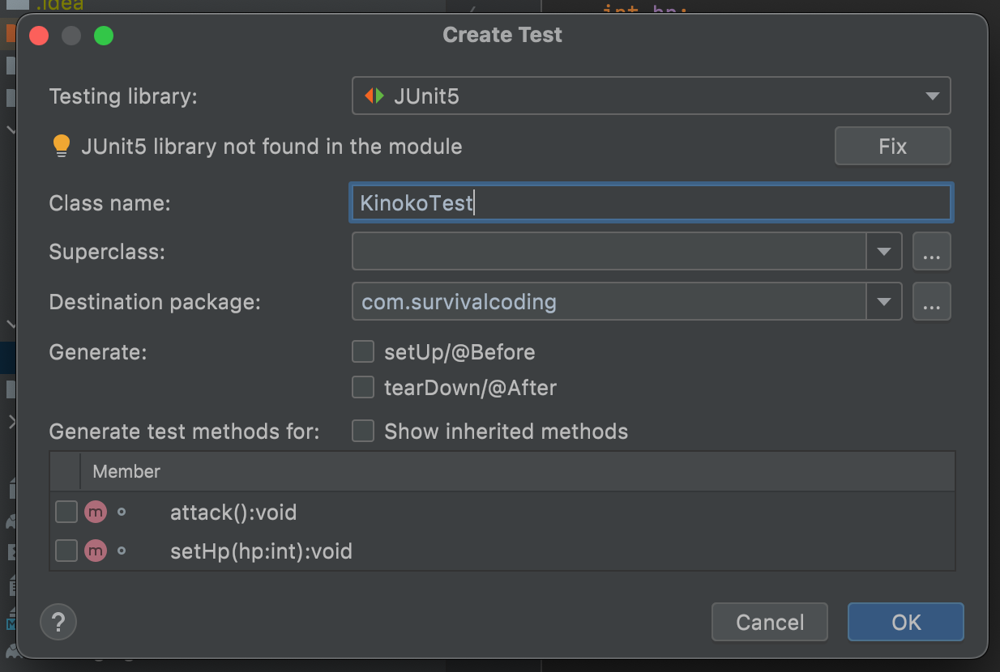

# TestCode

### TestCode 에 대한 root 설정 (이미 되어있다면 skip)
1. src 우클릭 → New > Directory 선택 → test로 이름 설정 → 하위에 java 생기도록 선택


<br>

2. (필요하면) src/test/java 폴더 우클릭 → **Mark Directory as → Test Sources Root** 클릭


<br>

3. root로 잘 설정되었는지 확인

   - java 폴더가 초록색으로 바뀌고, IntelliJ가 여기를 테스트 코드 위치로 인식
   - test 폴더도 하늘색 네모가 떠 있어야 TestCode가 정해진 위치에 생성된다

### Create TestCode
1. 테스트를 하고 싶은 클래스 파일을 고른다
2. 클래스 이름 위에서 option + enter → CreateTest
   
   

### TestCode 코드 작성하기
```java
// KinokoTest
package com.survivalcoding;
import org.junit.jupiter.api.DisplayName;
import org.junit.jupiter.api.Test;
import static org.junit.jupiter.api.Assertions.*;

    class KinokoTest {
        @Test
        @DisplayName("kinoko 객체 생성시 hp는 50이어야한다")
        void testCreate(){
            Kinoko kinoko = new Kinoko();
            assertEquals(50, kinoko.hp);
        }
    
        @Test
        @DisplayName("kinoko의 hp 설정이 잘되는지 확인")
        void testSetHp(){
            Kinoko kinoko = new Kinoko();
            kinoko.setHp(200);
            assertEquals(200, kinoko.hp);
        }
    }
```
- [검증 단계] given(준비) → when(실행) → then(검증)
- `assertEquals()` 예측 값과 실행 값이 동일한지 확인해주는 함수
  - <a href="https://www.baeldung.com/junit-assertions">[참고] 🔗 다양한 형태의 assert 함수</a>
- 라인 수를 알려주는 쪽에 있는 녹색 세모 누르면 테스트를 단위별로 진행할 수 있다
    - 모든 테스트를 한번에 진행하고자 한다면 class 이름 옆의 녹색 세모 누르기!
- 검증할 수 있는 모든 항목(public)을 테스트하는 것이 좋다
    - private는 테스트 불가능
- [참고] command + b 연결된 클래스로 이동


### root 설정을 했는데도 정해진 폴더에 TestCode가 생성 안된다면

- [ ] src/test/java 존재하는지 확인
    - [ ] src/test 폴더에 하늘색 네모가 붙어있는지 확인
    - [ ] src/test/java 폴더가 초록색인지 확인
- [ ] IntelliJ 재실행
- [ ] 코드가 꼬였을 수 있으니, 이전 상태로 되돌아가서 재시도